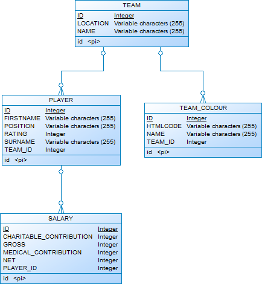

JPA Projections Example TEST SYNCING OTHER
===================

Overview
-----------

The JPA Projections example project is intended to demonstrate the following:
* Use of a Hibernate Interceptor to detect entity changes in the ``Persistence Context``
* Use of a Hibernate Interceptor to react to entity changes in the database
* Use of Observer design pattern to watch and react to entity persistence changes
* Use of the Command design pattern to provide a generic approach to syncing different entity types to an external source
* Use of DTO Projections in order to obtain a non ``Persistence Context`` managed instance of an entity
* Comparison of entity versions using [Hibernate Envers](https://docs.jboss.org/envers/docs/) and [java-object-diff](https://github.com/SQiShER/java-object-diff)

Scenario
-----------

The JPA Projections example project assumes the following scenario:
* It is an application that manages the lifecycle of Football Teams (CRUD operations)
* The Football Team entities are very large entity graphs (you need to use your imagination on this one!)
* When a Football Team has its data changed and it is persisted to the database, this application needs to react to that event by *syncing* a subset of the Football Team entity to an external system

Constraints
-----------

The JPA Projections example project assumes the following constraints:
* Entities should adhere to the [Single Responsibility Principle](https://en.wikipedia.org/wiki/Single_responsibility_principle). The entities should not contain any business logic or decorator interfaces to track whether they need to be synced
* The entities should avoid eagerly loading any of their associated collections
* When syncing data to the external system, DTO Projections should be used rather then the entities themselves in order to create efficient and performant data retrieval queries and to remove the need for a managed ``Persistence Context``

Walkthrough
-----------
The logical data model used in the JPA Projections example project appears below:



The SQL that Hibernate uses to create the database struture is shown below:

```SQL
create sequence hibernate_sequence start with 1 increment by 1;
create table PLAYER (ID integer not null, FIRSTNAME varchar(255), POSITION varchar(255), RATING integer, SURNAME varchar(255), TEAM_ID integer, primary key (ID));
create table SALARY (ID integer not null, CHARITABLE_CONTRIBUTION integer, GROSS integer, MEDICAL_CONTRIBUTION integer, NET integer, PLAYER_ID integer, primary key (ID));
create table TEAM (ID integer not null, LOCATION varchar(255), NAME varchar(255), primary key (ID));
create table TEAM_COLOUR (ID integer not null, HTMLCODE varchar(255), NAME varchar(255), TEAM_ID integer, primary key (ID));
alter table PLAYER add constraint FK_TEAM_ID foreign key (TEAM_ID) references TEAM;
alter table SALARY add constraint FK_PLAYER_ID foreign key (PLAYER_ID) references PLAYER;
alter table TEAM_COLOUR add constraint FK_TEAM_ID foreign key (TEAM_ID) references TEAM;
```

Chnages to the entities are *intercepted* via [EntityChangeInterceptor](https://github.com/damianmcdonald/jpaprojections/blob/master/src/main/java/com/github/damianmcdonald/jpaprojections/interceptor/EntityChangeInterceptor.java) which implemenets [EmptyInterceptor](https://docs.jboss.org/hibernate/orm/5.2/javadocs/org/hibernate/EmptyInterceptor.html).

It intercepts:

* [onFlushDirty](https://docs.jboss.org/hibernate/orm/5.2/javadocs/org/hibernate/EmptyInterceptor.html#onFlushDirty-java.lang.Object-java.io.Serializable-java.lang.Object:A-java.lang.Object:A-java.lang.String:A-org.hibernate.type.Type:A-) which is invoked when entities are marked as changed
* [postFlush](https://docs.jboss.org/hibernate/orm/5.2/javadocs/org/hibernate/EmptyInterceptor.html#postFlush-java.util.Iterator-) which is invoked after the entity has been persisted to the database

The [Observer design pattern](https://en.wikipedia.org/wiki/Observer_pattern) is used to watch and react to changes to the entities.

* [SyncTrack](https://github.com/damianmcdonald/jpaprojections/blob/master/src/main/java/com/github/damianmcdonald/jpaprojections/sync/SyncTrack.java) is the [Observable](https://docs.oracle.com/javase/8/docs/api/java/util/Observable.html)
* [SyncAction](https://github.com/damianmcdonald/jpaprojections/blob/master/src/main/java/com/github/damianmcdonald/jpaprojections/sync/SyncAction.java) is the [Observer](https://docs.oracle.com/javase/8/docs/api/java/util/Observer.html)

The [Command design pattern](https://en.wikipedia.org/wiki/Command_pattern) is used to provide a common syncing interface with entity specific implementations

* [SyncCommand](https://github.com/damianmcdonald/jpaprojections/blob/master/src/main/java/com/github/damianmcdonald/jpaprojections/sync/SyncCommand.java) is an abstract class that defines generic command behaviour
* [TeamSyncCommand](https://github.com/damianmcdonald/jpaprojections/blob/master/src/main/java/com/github/damianmcdonald/jpaprojections/sync/TeamSyncCommand.java) is an concrete command implementation that defines specific syncing behaviour for a ``Team`` entity.

In the [TeamDao](https://github.com/damianmcdonald/jpaprojections/blob/master/src/main/java/com/github/damianmcdonald/jpaprojections/dao/TeamDao.java) we don't want to retrieve a ``Persistence Context`` managed entity. Instead, we use a [DTO Projections](https://vladmihalcea.com/the-best-way-to-map-a-projection-query-to-a-dto-with-jpa-and-hibernate/) technique in order to obtain a subset of the `Team` entity which does not load unnecessary data and does not incur ``Persistence Context`` management overhead.

```java
public TeamDto getTeamProjection( int id ) {

    final List<PlayerDto> playersDto = super.entityManager
            .createQuery("select new com.github.damianmcdonald.jpaprojections.dto.PlayerDto(" +
                    "p.firstName, p.surname, p.position, p.rating, s.net, s.charitableContribution" +
                    ") from Player p join p.salary s where p.team.id = :id and p.rating > 92", PlayerDto.class)
            .setParameter("id", id)
            .getResultList();

    final TeamDto teamDto = super.entityManager
            .createQuery("select new com.github.damianmcdonald.jpaprojections.dto.TeamDto(t.name, t.location) from Team t where t.id = :id", TeamDto.class)
            .setParameter("id", id)
            .getSingleResult();

    teamDto.setPlayers(playersDto);

    return teamDto;
}
```

[Hibernate Envers](https://docs.jboss.org/envers/docs/) is enabled by adding the ``@Audited`` at ``@NonAudited`` annotations to the entities that we wish to audit.

We can then obtain previous and current entity revisions via Embers and compare them usng [java-object-diff](https://github.com/SQiShER/java-object-diff), as shown in [SimulateApp](https://github.com/damianmcdonald/jpaprojections/blob/master/src/test/java/com/github/damianmcdonald/jpaprojections/SimulateApp.java):

```java
@SpringBootTest
public class SimulateApp {

    private static final int REVISION_CURRENT = 0;
    private static final int REVISION_PREVIOUS = 0;
    private static SyncTrack syncTrack;
    private static SyncAction syncAction;
    private static EntityDao teamDao;
    private static AuditReader reader;

    @BeforeClass
    public static void getSyncManager() {
        syncAction = syncAction.getInstance();
        syncTrack = SyncTrack.getInstance();
        syncTrack.registerObserver(syncAction);
        reader = AuditReaderFactory.get(EntityManagerProvider.getInstance().getEntityManager());
        teamDao = new TeamDao();
    }

    @Test
    public void simulate() {

        final Team cowboys = getTeamById(2);
        // change the location of the Dallas Cowboys from Dallas to Austin
        cowboys.setLocation("Austin");

        final Team eagles = getTeamById(4);
        // change the location of the Philadelphia Cowboys from Philadelphia to New Jersey
        eagles.setLocation("New Jersey");

        // persist the changes
        saveTeam(cowboys);
        saveTeam(eagles);

        // change the location of the Austin Cowboys from Austin to San Antionio
        cowboys.setLocation("San Antonio");

        // persist the changes
        saveTeam(cowboys);

        // use Hibernate Envers to retreive the previous and current versions of the specific Team
        final Team currentTeamRevision = getRevision(cowboys.getId(), REVISION_CURRENT);
        final Team previousTeamRevision = getRevision(cowboys.getId(), REVISION_PREVIOUS);

        // determine what has changed between the previous and current versions of the cowboys Team entity
        diff(previousTeamRevision, currentTeamRevision)
                .forEach(e -> {
                    Assert.assertEquals("Changed attributes should be location", "location", e.getAttribute());
                    Assert.assertEquals("Previous value should be Austin", "Austin", e.getPreviousVal());
                    Assert.assertEquals("Updated value should be San Antonio", "San Antonio", e.getCurrentVal());
                    System.out.println(e);
                });

    }

    private Team getTeamById(final int id) {
        return (Team) teamDao.findOne(id);
    }

    private void saveTeam(final Team team) {
        teamDao.update(team);
    }

    private Team getRevision(final int id, final int revision) {
        return reader.find(Team.class, id, getRevisionId(id) - revision);
    }

    private int getRevisionId(final int id) {
        return reader.getRevisions(Team.class, id).stream()
                .sorted((f1, f2) -> Long.compare(f2.intValue(), f1.intValue()))
                .findFirst().get().intValue();
    }

    private Set<ObjectDiff>  diff(final Object base, final Object compare) {
        final Set<ObjectDiff> changedObjects = new HashSet<ObjectDiff>();
        final DiffNode diff = ObjectDifferBuilder.buildDefault().compare(compare, base);
        diff.visit(new DiffNode.Visitor() {
            public void node(DiffNode node, Visit visit) {
                if(node.getParentNode() != null) {
                    changedObjects.add(
                            new ObjectDiff(
                                    node.getPropertyName(),
                                    node.canonicalGet(base).toString(),
                                    node.canonicalGet(compare).toString()
                            )
                    );
                }
            }
        });
        return changedObjects;
    }

    private class ObjectDiff {
        private final String attribute;
        private final String previousVal;
        private final String currentVal;

        public ObjectDiff(final String attribute, final String previousVal, final String currentVal) {
            this.attribute = attribute;
            this.previousVal = previousVal;
            this.currentVal = currentVal;
        }

        public String getAttribute() {
            return attribute;
        }

        public String getPreviousVal() {
            return previousVal;
        }

        public String getCurrentVal() {
            return currentVal;
        }

        @Override
        public String toString()
        {
            return ToStringBuilder.reflectionToString(this);
        }
    }

}
```

Getting started
-----------------

The library was built using the following toolchain:

* [Java Oracle JDK 1.8](http://www.oracle.com/technetwork/java/javase/downloads/index.html)
* [Maven 3.2.3](https://maven.apache.org/download.cgi)

Your mileage may vary with versions different than the ones specified above.

Follow these steps to get started:

1) Git-clone this repository.

```
git clone git://github.com/damianmcdonald/jpaprojections.git my-project

```

2) Change directory into your clone:

```
cd my-project
```

3) Use Maven to compile everything:

```
mvn clean package
```

4) Run the [SimulateApp](https://github.com/damianmcdonald/jpaprojections/blob/master/src/test/java/com/github/damianmcdonald/jpaprojections/SimulateApp.java) to verify behaviour:

```
mvn -Dtest=SimulateApp test
```

5) A successful output is shown below:

```log
Running com.github.damianmcdonald.jpaprojections.SimulateApp
2018-06-28 16:17:45.200  INFO   --- [           main] o.hibernate.jpa.internal.util.LogHelper  : HHH000204: Processing PersistenceUnitInfo [
	name: entity-jpa
	...]
2018-06-28 16:17:45.253  INFO   --- [           main] org.hibernate.Version                    : HHH000412: Hibernate Core {5.0.12.Final}
2018-06-28 16:17:45.254  INFO   --- [           main] org.hibernate.cfg.Environment            : HHH000206: hibernate.properties not found
2018-06-28 16:17:45.256  INFO   --- [           main] org.hibernate.cfg.Environment            : HHH000021: Bytecode provider name : javassist
2018-06-28 16:17:45.285  INFO   --- [           main] o.hibernate.annotations.common.Version   : HCANN000001: Hibernate Commons Annotations {5.0.1.Final}
2018-06-28 16:17:45.409  WARN   --- [           main] org.hibernate.orm.connections            : HHH10001002: Using Hibernate built-in connection pool (not for production use!)
2018-06-28 16:17:45.411  INFO   --- [           main] org.hibernate.orm.connections            : HHH10001005: using driver [org.h2.Driver] at URL [jdbc:h2:mem:testdb;DB_CLOSE_DELAY=-1]
2018-06-28 16:17:45.411  INFO   --- [           main] org.hibernate.orm.connections            : HHH10001001: Connection properties: {}
2018-06-28 16:17:45.411  INFO   --- [           main] org.hibernate.orm.connections            : HHH10001003: Autocommit mode: false
2018-06-28 16:17:45.413  INFO   --- [           main] .c.i.DriverManagerConnectionProviderImpl : HHH000115: Hibernate connection pool size: 20 (min=1)
2018-06-28 16:17:45.514  INFO   --- [           main] org.hibernate.dialect.Dialect            : HHH000400: Using dialect: org.hibernate.dialect.H2Dialect
2018-06-28 16:17:45.999  INFO   --- [           main] org.hibernate.tool.hbm2ddl.SchemaExport  : HHH000227: Running hbm2ddl schema export
2018-06-28 16:17:46.021  INFO   --- [           main] org.hibernate.tool.hbm2ddl.SchemaExport  : HHH000476: Executing import script '/import.sql'
2018-06-28 16:17:46.034  INFO   --- [           main] org.hibernate.tool.hbm2ddl.SchemaExport  : HHH000230: Schema export complete
Jun 28, 2018 4:17:46 PM com.github.damianmcdonald.jpaprojections.interceptor.EntityChangeInterceptor onFlushDirty
INFO: Entered method onFlushDirty.
Jun 28, 2018 4:17:46 PM com.github.damianmcdonald.jpaprojections.interceptor.EntityChangeInterceptor onFlushDirty
INFO: Entered method onFlushDirty.
Jun 28, 2018 4:17:46 PM com.github.damianmcdonald.jpaprojections.interceptor.EntityChangeInterceptor postFlush
INFO: Entered method postFlush.
Jun 28, 2018 4:17:46 PM com.github.damianmcdonald.jpaprojections.sync.SyncAction update
INFO: Entered update method
2018-06-28 16:17:46.357  INFO   --- [           main] o.h.h.i.QueryTranslatorFactoryInitiator  : HHH000397: Using ASTQueryTranslatorFactory
Jun 28, 2018 4:17:46 PM com.github.damianmcdonald.jpaprojections.sync.TeamSyncCommand doSync
INFO: Syncing TEAM entity {
  "name" : "Eagles",
  "location" : "New Jersey",
  "players" : [ {
    "firstName" : "Reggie",
    "surname" : "White",
    "position" : "Defensive End",
    "rating" : 98,
    "netSalary" : 43324,
    "charitableContribution" : 7673565
  }, {
    "firstName" : "Chris",
    "surname" : "Carter",
    "position" : "Wide Receiver",
    "rating" : 95,
    "netSalary" : 75767,
    "charitableContribution" : 4234
  } ]
}
Jun 28, 2018 4:17:46 PM com.github.damianmcdonald.jpaprojections.sync.SyncAction update
INFO: Entered update method
Jun 28, 2018 4:17:46 PM com.github.damianmcdonald.jpaprojections.sync.TeamSyncCommand doSync
INFO: Syncing TEAM entity {
  "name" : "Cowboys",
  "location" : "Austin",
  "players" : [ {
    "firstName" : "Emmitt",
    "surname" : "Smith",
    "position" : "Running Back",
    "rating" : 95,
    "netSalary" : 34869657,
    "charitableContribution" : 765346
  }, {
    "firstName" : "Dieon",
    "surname" : "Sanders",
    "position" : "Cornerback",
    "rating" : 99,
    "netSalary" : 956732235,
    "charitableContribution" : 2342435
  } ]
}
Jun 28, 2018 4:17:46 PM com.github.damianmcdonald.jpaprojections.interceptor.EntityChangeInterceptor postFlush
INFO: Entered method postFlush.
Tests run: 1, Failures: 0, Errors: 0, Skipped: 0, Time elapsed: 1.544 sec - in com.github.damianmcdonald.jpaprojections.SimulateApp

Results :

Tests run: 1, Failures: 0, Errors: 0, Skipped: 0
```
